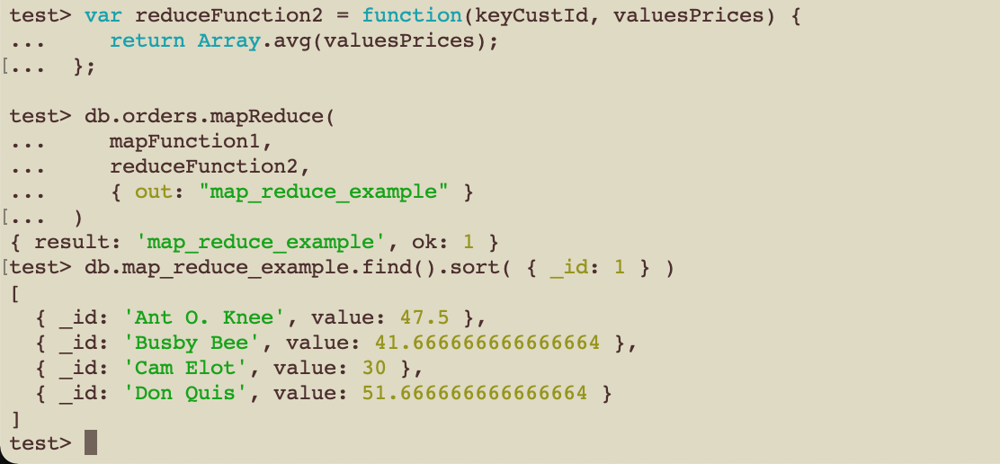

## Assignment 3 report
I had some trouble installing MongoDB as my command line tools were outdated, 
and it took a couple of hours updating them, but after doing that I had no
further problems. 

Here is a screenshot of the validation

Here is a crud operation working:

Here is the example of the map-reduce working: 

And finally here is my mapreduce function. I had some trouble understanding 
the more difficult example, and coming up with a function that was not too
difficult to implement, so I ended up with just grouping them by cust_id and 
finding their average earnings. I realize that this may be too easy as I only 
had to change one word in the reduceFunction, but I will have a further look 
to these functions later

